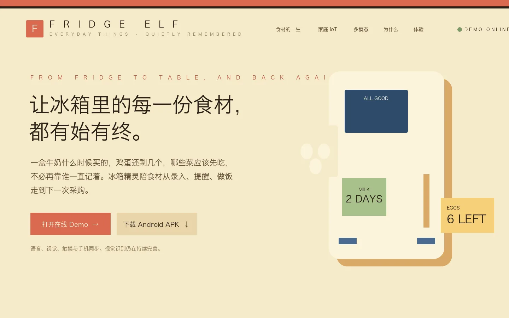
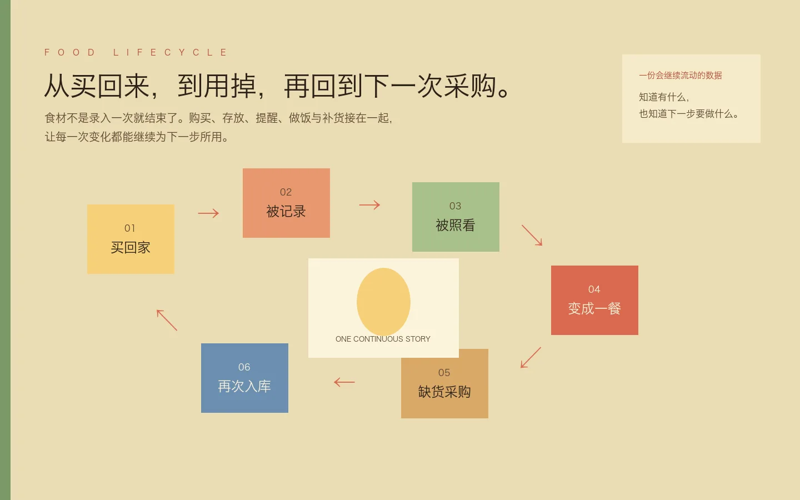
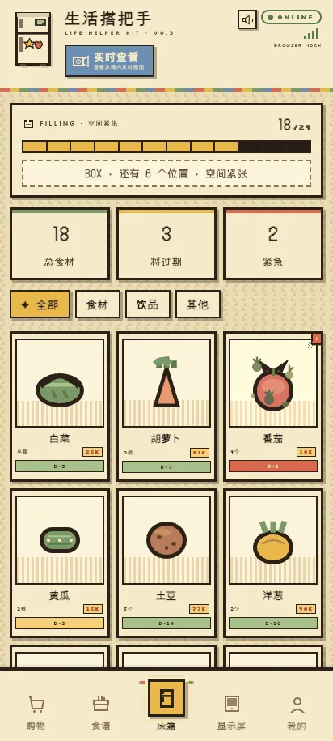
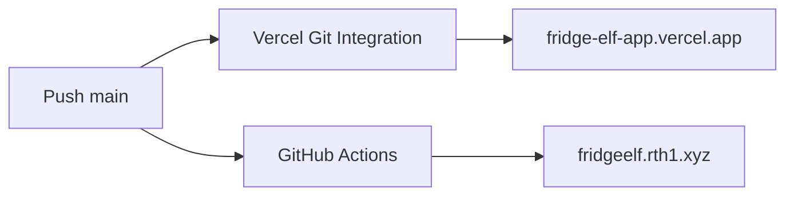

<p align="center">
  <sub>FRIDGE ELF · 冰箱精灵</sub>
</p>

<h1 align="center">让冰箱里的每一份食材，都有始有终。</h1>

<p align="center">
  一盒牛奶什么时候买的，鸡蛋还剩几个，哪些菜应该先吃，不必再靠家里的某一个人一直记着。<br />
  冰箱精灵留在冰箱旁，也跟着家人到了手机上，陪食材从进入家庭走到一餐，再回到下一次采购。
</p>

<p align="center">
  <a href="https://github.com/abraxas914/fridge-elf-web/actions/workflows/ci.yml">
    
  </a>
  <a href="https://github.com/abraxas914/fridge-elf-web/actions/workflows/deploy-rth.yml">
    
  </a>
</p>

<p align="center">
  <a href="https://fridge-elf-app.vercel.app/demo"><b>在线 Demo</b></a>
  &nbsp;·&nbsp;
  <a href="https://fridge-elf-app.vercel.app"><b>Vercel 入口</b></a>
  &nbsp;·&nbsp;
  <a href="https://fridgeelf.rth1.xyz"><b>自定义域名</b></a>
</p>



## 家庭中的实体，也应该拥有可以继续使用的数据

聊天记录和照片很容易被检索，因为它们从一开始就是数字信息。菜市场买回来的菜、随手放进冰箱的酸奶却不是这样。它们进入家庭以后，数量、购买时间和新鲜程度往往只存在于某个人的记忆里。

这也是为什么食材会慢慢被挡在冰箱后面，临期时没有被看见，出门买菜时又无法确认家里还剩什么。冰箱精灵不要求人先养成一套复杂的记录习惯，而是把语音、视觉、触摸和文字放在物资流转的入口，让记录尽量发生在顺手的那一刻。

它从冰箱这个具体场景开始。冰箱旁的小屏和家人手中的手机共享同一份库存：在家可以直接说一句、点一下；出门以后仍然知道还有什么、哪一批该先吃。这里的 IoT 不是一串协议名称，而是家庭里的信息终于能跟着食材一起流动。

## 食材的全生命周期



```text
买回家 → 被记录 → 被照看 → 变成一餐 → 缺货采购 → 再次入库
```

食材不是录入一次就结束了。库存、临期提醒、菜谱、三餐计划和采购清单连接在一起，前一步留下的信息会自然成为下一步的依据。用户看到的不只是一张静止的清单，而是一件实体物品在家庭里的完整过程。

| 能力 | 用户得到什么 |
|---|---|
| 食材库存 | 知道有什么、还剩多少、哪一批该先吃 |
| 语音与触摸 | 手上拿着东西时也能快速录入或取出 |
| 菜谱与采购 | 从现有库存走到一餐，再回到采购 |
| 家庭信息 | 在冰箱旁看见便签、三餐、日历与提醒 |
| 只读 Agent | 根据当前模拟库存回答问题、给出食谱建议，不改动 Demo 世界 |
| 食谱插画 | 将中文食谱转换为四种信息结构一致的步骤图 |

## 一个小终端，慢慢退到环境里

<table>
  <tr>
    <td width="42%" align="center">
      
    </td>
    <td>
      <p>
        智能不一定要被集中到一台更复杂的家电里。更自然的方向，是让一个轻量入口贴近冰箱、衣柜或药柜，在人原本就会经过的地方理解正在发生的事。
      </p>
      <p>
        今天它照看冰箱里的食材；同一种思路也可以走到衣物与药品旁边。终端没有真正消失，只是不再要求人专程找到它、打开它，再把生活翻译成一串表单。
      </p>
      <p>
        这是冰箱精灵对 Ubiquitous AI 的朴素理解：语音、视觉、文字、软件、硬件、云端与本地并不是七个卖点，而是在合适的位置共同接住一次真实行为。
      </p>
    </td>
  </tr>
</table>

## 仓库里有什么

这个仓库同时承载：

- `/`：面向评委、合作方和体验者的 Landing Page；
- `/demo`：可直接操作的 Smart Tag 浏览器 Demo；
- 基于当前 mock 世界快照的无状态 Recipe Agent 与在线推荐；
- Android 稳定版 Release 信息与 APK 下载入口；
- 四种菜谱插画风格共用的 `RecipePlan` 与 Image2 服务端调用；
- Vercel 动态能力与 Retinbox 静态镜像的双端发布。

完整的菜谱插画 HTTP 合约见 [Web Preview 菜谱插画规范](docs/WEB_PREVIEW_SPEC.md)。

## 本地运行

需要 Node.js 22。

```bash
npm ci
npm run dev
```

打开：

- Landing Page：`http://127.0.0.1:5173/`
- 浏览器 Demo：`http://127.0.0.1:5173/demo`

运行质量检查：

```bash
npm test
npm run build
npm run test:rth-html
npm run e2e
```

重新生成 README 视觉资产：

```bash
npm run dev -- --port 4173 --strictPort
npm run capture:readme
```

脚本会固定生成：

- `docs/readme/landing-hero.webp` — `1440×900`
- `docs/readme/food-lifecycle.webp` — `1440×900`
- `docs/readme/mobile-demo.webp` — `412×915`

每张图会经过 ImageMagick 压缩与尺寸检查，单张不得超过 500 KB。

## API 与密钥边界

| 路由 | 用途 | 运行位置 |
|---|---|---|
| `GET /api/releases/latest` | 读取符合约定的 Android 稳定 Release | Vercel Function |
| `GET /api/download/android` | 跳转到与 Release Tag 对应的 APK | Vercel Function |
| `POST /api/demo/session` | 签发两小时匿名 Demo 会话 | Vercel Function |
| `POST /api/demo/agent` | 只读 Agent 对话 | Vercel Function |
| `POST /api/demo/recommend` | 基于当前 mock 世界的在线推荐 | Vercel Function |
| `POST /api/illustrate` | 生成单页 `1200×1440` 菜谱插画 | Vercel Function |

本地真实 API 联调使用未提交的 `.env.local`：

```dotenv
DEMO_SESSION_SECRET=...
HEADLESS_GATEWAY_BASE_URL=...
HEADLESS_GATEWAY_API_KEY=...
HEADLESS_GATEWAY_DEFAULT_MODEL=...
HEADLESS_IMAGE_GATEWAY_BASE_URL=...
HEADLESS_IMAGE_GATEWAY_API_KEY=...
HEADLESS_IMAGE_GATEWAY_MODEL=...
```

安全边界：

- 所有上游地址与密钥只能进入本地 `.env.local` 或 Vercel Environment Variables；
- 密钥不得使用 `VITE_*` 前缀，也不得进入前端 bundle；
- 浏览器会话是无账户、两小时有效的 HMAC Token，只保存在 `sessionStorage`；
- Agent 只接收裁剪后的 mock 世界快照；响应字段会在服务端再次白名单过滤；
- Agent、推荐和图片生成失败时，界面回退到内置 Fixture，不影响 Demo 状态机；
- 浏览器只提交 `{ style, recipeText, page }`，不能提交 raw prompt；
- 服务端重新编译 `RecipePlan`，每页最多 6 步；模型由服务端配置；
- 库存、规划、对话和生成结果均不写入持久存储；刷新或“重新开始 Demo”会恢复初始世界；
- 当前文本网关上游为 HTTP，比赛 Demo 暂时接受 Vercel 到网关链路无 TLS 的风险；浏览器到 Vercel 仍为 HTTPS；
- Android 正式应用采用 BYOK，密钥持久化由 Android 工程在本地安全存储中处理，本 Web Demo 不向访客索取密钥。

> Retinbox 是独立静态镜像，不保存任何密钥。其 `/demo` 会跨域调用公开的 Vercel BFF，因此两个部署地址共享同一套 Agent、推荐与 Image2 能力。

## Android Release

当前状态：Android 仓库只有 **Pre-release Debug APK**，尚未发布可被 `/releases/latest` 读取的稳定 Release，因此 Landing Page 会显示「APK 正在准备中」。

稳定版本使用 `vX.Y.Z` Tag，并包含同名资产：

```text
smart-tag-android-vX.Y.Z.apk
smart-tag-android-vX.Y.Z.apk.sha256
```

符合约定的正式 Release 发布后，Vercel Landing Page 最多约 5 分钟更新下载信息。Release 与 APK 的构建、签名仍由 Android 仓库负责，这个 Web 仓库只消费发布结果。

## 一次推送，两个独立入口



两个发布通道互不等待、互不跳转：

- Vercel 原生 Git Integration 负责 `fridge-elf` Production；
- [Deploy Retinbox mirror](.github/workflows/deploy-rth.yml) 使用仓库 Secret `RTH_API_KEY` 发布静态镜像；
- [CI](.github/workflows/ci.yml) 在 Pull Request 与 `main` 上执行单测、构建和 Retinbox HTML 检查；
- 不需要在 GitHub 中保存 `VERCEL_TOKEN`。

一次性设置：

1. 将 Vercel 项目 `fridge-elf` 连接到 `abraxas914/fridge-elf-web`；
2. 在 GitHub Actions Secrets 中配置 `RTH_API_KEY`；
3. 将 `CI` 设置为 `main` 的 Required Check。

之后的日常发布只有一个动作：

```bash
git push origin main
```

两端会从同一个远程 Git SHA 独立构建。任意一端失败时，另一端仍可继续提供服务。
