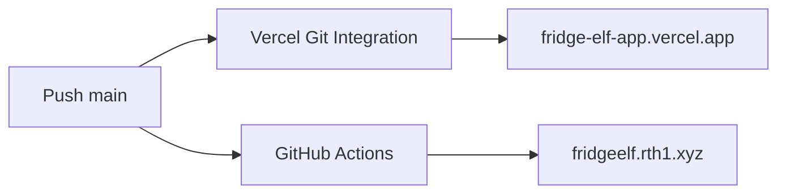

# Fridge Elf 双端自动发布与 README 设计规格

日期：2026-07-25

状态：已批准，进入实施

范围：

- `main` 推送后自动更新 Vercel 与 Retinbox
- Pull Request 基础质量检查
- 根目录 `README.md` 图文重构
- README 截图资产与可重复生成方式

不涉及：

- Android APK 构建与签名
- 自动创建 Android 正式 Release
- Image2 密钥或业务 API 行为调整
- 将两个托管入口互相重定向

## 1. 目标

同一份 Git 提交需要稳定发布到两个互相独立的生产入口：

- `https://fridge-elf-app.vercel.app`
- `https://fridgeelf.rth1.xyz`

开发者只需将提交推送到 `main`，无需再次从本地手工执行两次部署。

README 同时服务两类读者：

1. 黑客松评委与潜在合作方：先理解真实生活问题、食材生命周期、家庭 IoT 与 Ubiquitous AI 判断。
2. 开发者与维护者：快速找到在线入口、本地运行方式、API 边界、Release 规则和双端部署机制。

## 2. 自动发布方案

### 2.1 采用方案

采用“托管平台原生 Git 集成 + GitHub Actions”双通道：

```text
push main
├─ Vercel Git Integration → fridge-elf production
└─ GitHub Actions         → fridgeelf.rth1.xyz
```

Vercel 使用平台原生 Git Integration，将现有项目 `fridge-elf` 连接到：

```text
https://github.com/abraxas914/fridge-elf-web
```

Retinbox 继续使用：

```text
.github/workflows/deploy-rth.yml
```

以及现有 GitHub Actions Secret：

```text
RTH_API_KEY
```

### 2.2 选择理由

- 不新增长期有效的 `VERCEL_TOKEN`。
- Vercel 构建日志、别名切换和回滚继续由 Vercel 原生管理。
- Retinbox 使用现有 Action 与密钥，不改变已经验证的发布链路。
- 两个部署相互独立；某一托管商失败时，另一端仍可完成更新。
- 不引入额外编排服务或 Deploy Hook Secret。

### 2.3 触发规则

| 事件 | 基础检查 | Vercel | Retinbox |
|---|---:|---:|---:|
| Pull Request | 是 | Preview 由 Vercel 决定 | 否 |
| Push `main` | 是 | Production | Production |
| 手动 `workflow_dispatch` | Retinbox Action 内执行 | 不变 | Production |

Vercel 是否生成 Pull Request Preview 由项目 Git 设置控制，不作为本次验收阻塞项。

### 2.4 质量检查

新增轻量 GitHub Actions 工作流：

```text
.github/workflows/ci.yml
```

触发：

- Pull Request
- Push `main`

执行：

```bash
npm ci
npm test
npm run build
npm run test:rth-html
```

Playwright 完整浏览器测试继续在本地发布前运行，不在首版 CI 中下载浏览器，以控制黑客松阶段的执行时间与失败面。

基础检查与两个生产部署在平台上分别显示状态。首版不让 Retinbox Action 等待 `ci.yml`，避免 GitHub Actions 跨工作流编排增加复杂度；合并前由 Branch Protection 将 `CI` 设为 Required Check。

### 2.5 失败与回滚

- Vercel 失败：Retinbox 不受影响；在 Vercel Deployment 中查看构建日志或回滚别名。
- Retinbox 失败：Vercel 不受影响；重新运行 `Deploy Retinbox mirror`。
- CI 失败：PR 不应合并；已经发生的 `main` 推送不会被自动撤销。
- 两端发布必须来自同一个远程 Git SHA；README 不使用“永远同步”之类无法保证的表述。

## 3. README 视觉方向

已选择 C「产品 × 工程」。

README 上半部像一份克制的产品介绍，下半部像一份可以直接接手维护的工程说明。

不使用外部品牌设计，不复制 Landing Page 的整页结构。只复用 Fridge Elf 自身：

- 奶油底色
- 珊瑚、鼠尾草绿与深蓝
- 像素硬边
- 平实、细腻的中文
- 真实产品截图

## 4. README 信息结构

### 4.1 顶部品牌区

使用 GitHub Markdown 支持的居中 HTML：

- `FRIDGE ELF`
- Hero Slogan：`让冰箱里的每一份食材，都有始有终。`
- 一段不超过 90 字的产品说明
- CI、Retinbox Deploy、License 等状态徽章
- 三个入口按钮式链接：
  - 在线 Demo
  - Vercel
  - 自定义域名

不使用访问量、星标数量或虚构状态徽章。

### 4.2 Hero 截图

首页截图宽幅展示，直接让读者看见当前产品，而不是用概念 Banner 替代。

资产：

```text
docs/readme/landing-hero.webp
```

### 4.3 为什么做

用两段短文说明：

- 家庭中的实体数据难以管理。
- 冰箱精灵让食材在进入、使用与再次采购之间留下可以继续使用的信息。

不使用“颠覆”“革命性”“重新定义”等营销词。

### 4.4 食材全生命周期

使用一张截图与一行 Markdown 流程：

```text
买回家 → 被记录 → 被照看 → 变成一餐 → 缺货采购 → 再次入库
```

资产：

```text
docs/readme/food-lifecycle.webp
```

### 4.5 多端体验

说明冰箱旁的小屏、手机与共享库存的产品关系，不罗列 T5AI、Android、Wi-Fi、MQTT 等基础实现。

用一张手机 Demo 截图展示实际可操作界面：

```text
docs/readme/mobile-demo.webp
```

### 4.6 能力概览

使用紧凑表格：

| 能力 | 用户得到什么 |
|---|---|
| 食材库存 | 知道有什么、还剩多少、哪一批该先吃 |
| 语音与触摸 | 手上拿着东西时也能快速录入 |
| 菜谱与采购 | 从现有库存走到一餐，再回到采购 |
| 家庭信息 | 在冰箱旁看见便签、三餐与日历 |
| 食谱插画 | 将中文食谱转换成结构一致的步骤图 |

### 4.7 本地运行与验证

保留可复制命令：

```bash
npm ci
npm run dev
npm test
npm run build
npm run e2e
```

明确本地 Landing 与 `/demo` 地址。

### 4.8 API 与安全边界

保留五个路由说明，但压缩为表格。

明确：

- Image2 Key 只存在于服务端环境变量。
- 浏览器不提交 raw prompt。
- Retinbox 是静态镜像，不承载 Vercel Functions。
- 自定义域名的静态 Demo 与 Vercel API 能力不是完全相同的运行环境。

### 4.9 Android Release 规范

区分当前状态与正式约定：

- 当前只有 Pre-release Debug APK，不会被 `/releases/latest` 读取。
- 正式 Release 使用 `vX.Y.Z`。
- 必须包含约定命名的 APK；SHA256 文件建议同时上传。
- 正式 Release 出现后，Vercel Landing 最多约 5 分钟显示下载入口。

### 4.10 双端部署

用 Mermaid 流程图表达：



列出一次性配置和日常操作：

- 一次性：连接 Vercel Git、配置 `RTH_API_KEY`、设置 Branch Protection。
- 日常：提交并推送 `main`。

## 5. 截图资产规范

### 5.1 资产

提交三张 WebP：

| 文件 | 内容 | 建议尺寸 |
|---|---|---:|
| `landing-hero.webp` | Landing Hero 桌面端 | 1440×900 |
| `food-lifecycle.webp` | 生命周期章节桌面端 | 1440×900 |
| `mobile-demo.webp` | 手机 Demo 主要界面 | 412×915 |

### 5.2 生成方式

新增：

```text
scripts/capture-readme-assets.mjs
```

脚本使用仓库现有 Playwright：

- 默认读取本地 `http://127.0.0.1:4173`
- 等待字体与主要标题
- 截取固定视口
- 输出 PNG 临时图

ImageMagick 将 PNG 转换为质量适中的 WebP。若本机缺少 ImageMagick，脚本明确报错并保留 PNG，不静默生成不同格式。

截图不包含 API Key、用户数据、浏览器工具栏或本地路径。

## 6. 仓库文件变更

新增：

```text
.github/workflows/ci.yml
docs/readme/landing-hero.webp
docs/readme/food-lifecycle.webp
docs/readme/mobile-demo.webp
scripts/capture-readme-assets.mjs
docs/superpowers/plans/2026-07-25-dual-deploy-readme-implementation.md
```

修改：

```text
README.md
.gitignore
```

`.superpowers/` 加入 `.gitignore`，视觉草稿不进入项目历史。

外部一次性配置：

```text
Vercel project fridge-elf
  ↳ connect abraxas914/fridge-elf-web
```

## 7. 验收标准

- `main` 推送能独立触发 Vercel Production 与 Retinbox Production。
- GitHub 仓库只需要现有 `RTH_API_KEY`；不新增 `VERCEL_TOKEN`。
- Pull Request 会运行基础 CI，但不会触发 Retinbox Production。
- README 顶部三个入口均可点击。
- README 三张 WebP 在 GitHub 中正常显示，单张不超过 500 KB。
- README 先讲产品，再讲工程；不把基础技术栈当卖点。
- README 明确 Vercel 与 Retinbox 能力差异。
- Release 章节准确说明当前只有 Pre-release Debug APK。
- 生成脚本可重复产出相同尺寸截图。
- 现有单元测试、构建、Retinbox HTML 测试与 Playwright 测试继续通过。
